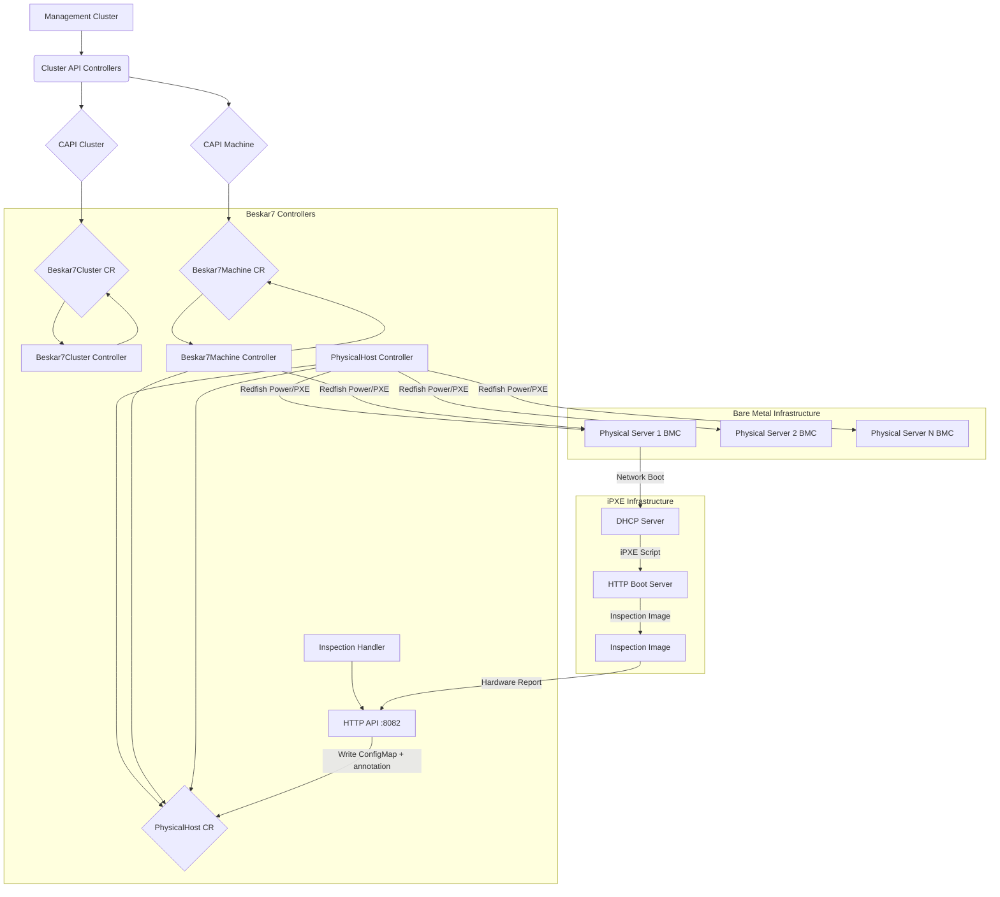

# Beskar7 Architecture

> **Audience:** Developers

This document describes the high-level architecture of the Beskar7 Cluster API infrastructure provider.

## Overview

Beskar7 integrates with the Kubernetes Cluster API (CAPI) framework to manage the lifecycle of bare-metal hosts as Kubernetes nodes. It uses a **simple, reliable approach**: Redfish for power management + iPXE for network boot + hardware inspection.

The architecture follows these principles:
- **Simplicity**: No complex vendor-specific workarounds
- **Reliability**: Uses only universally-supported Redfish features (power management and PXE boot)
- **Vendor Agnostic**: Works with any Redfish-compliant BMC
- **Observable**: Rich hardware inspection data collected before provisioning

The core components are custom Kubernetes controllers that watch CAPI and Beskar7 custom resources:



**Workflow:**
1. Users or higher-level controllers create CAPI `Cluster` and `Machine` resources
2. These trigger the creation of corresponding `Beskar7Cluster` and `Beskar7Machine` resources
3. Beskar7Machine controller claims an available PhysicalHost
4. PhysicalHost is powered on with PXE boot flag via Redfish
5. Server network boots to the inspection image via iPXE
6. Inspection image collects hardware details and reports back
7. Controller validates hardware meets requirements
8. Inspection image fetches the machine's bootstrap data, streams a digest-verified whole-disk image to the target disk, injects the bootstrap data into the image's `COS_OEM` partition, and reboots the host into the provisioned OS (no `kexec` — host firmware boots it)
9. Inspector confirms the write with a provisioned callback; the machine becomes ready and joins the cluster

## Controllers

### `PhysicalHost` Controller

**Manages:** `PhysicalHost` Custom Resources

**Responsibilities:**
- Represents a single physical server manageable via Redfish
- Establishes and maintains connection to the server's BMC using provided credentials (stored in a Secret)
- Monitors power state via Redfish
- Discovers basic system information (Manufacturer, Model, Serial Number)
- Reports host availability status based on Redfish connectivity and claim status
- Stores inspection reports received from inspection image
- Performs cleanup actions when PhysicalHost is deleted (power off)

**States:**
- `Enrolling` - Establishing initial Redfish connection
- `Available` - Ready to be claimed by a machine
- `InUse` - Claimed by a Beskar7Machine
- `Inspecting` - Running hardware inspection
- `Deploying` - Inspection passed; the inspector is writing the OS image to disk
- `Ready` - OS deployment complete (the inspector's provisioned callback was received)
- `Error` - Problem occurred

**Note:** This controller does NOT handle provisioning. It only manages power and tracks state.

### `Beskar7Machine` Controller

**Manages:** `Beskar7Machine` Custom Resources

**Owned By:** CAPI `Machine` resource

**Responsibilities:**
- Acts as the infrastructure provider for a specific Kubernetes node
- Implements the full inspection + provisioning workflow:

**Phase 1: Claim**
- Finds an `Available` `PhysicalHost` in the same namespace
- Claims the PhysicalHost by setting `spec.consumerRef`

**Phase 2: Boot Inspection**
- Connects to BMC via Redfish
- Sets one-time PXE boot flag
- Powers on the server
- Server network boots to inspection image via iPXE

**Phase 3: Wait for Inspection**
- Monitors PhysicalHost for inspection report
- Waits for inspection image to POST hardware details
- Timeout after 10 minutes if no report received

**Phase 4: Validate Hardware**
- Compares inspection report against `hardwareRequirements`:
  - Minimum CPU cores
  - Minimum memory GB
  - Minimum disk GB
- Rejects machine if requirements not met

**Phase 5: Provisioning**
- Once bootstrap data is ready, the inspector fetches it over the bearer-gated `/bootstrap` endpoint
- Inspector streams the digest-pinned whole-disk image to the target disk, verifying SHA-256 after the write
- Inspector injects the bootstrap data into the image's `COS_OEM` partition as a per-host Kairos cloud-config, then reboots the host into the provisioned OS via host firmware (no `kexec`)
- Inspector confirms success with `POST /api/v1/provisioned/{namespace}/{hostName}` before rebooting; a `--deployment-timeout` (default 20 min) bounds how long the host may stay in `Deploying` waiting for that signal
- Controller sets `providerID`, `Status.Ready`, `Status.Initialization.Provisioned`, and marks `InfrastructureReady` condition as `True` on receiving the provisioned callback

**Cleanup:**
- When deleted, releases the claimed PhysicalHost by clearing `spec.consumerRef`
- PhysicalHost transitions back to `Available` state

### `Beskar7Cluster` Controller

**Manages:** `Beskar7Cluster` Custom Resources

**Owned By:** CAPI `Cluster` resource

**Responsibilities:**
- Represents cluster-wide infrastructure concerns

**Derives the Control Plane Endpoint:**
1. Lists CAPI `Machine` resources with control plane label (`cluster.x-k8s.io/control-plane`)
2. Finds a `Machine` marked as `InfrastructureReady`
3. Extracts IP address from `Machine`'s `status.addresses` (preferring `InternalIP`, fallback to `ExternalIP`)
4. Populates `Beskar7Cluster`'s `status.controlPlaneEndpoint` field

**Discovers Failure Domains:**
1. Lists `PhysicalHost` resources in the same namespace
2. Extracts unique values from `topology.kubernetes.io/zone` label
3. Populates `Beskar7Cluster`'s `status.failureDomains` field

**Status Management:**
- Sets `ControlPlaneEndpointReady` condition
- Sets overall `status.ready` field

### `Inspection Handler`

**HTTP API:** Listens on port 8082

**Endpoint:** `POST /api/v1/inspection/{namespace}/{physicalhost-name}`

**Responsibilities:**
- Receives hardware inspection reports from inspection images
- Validates report structure
- Updates corresponding PhysicalHost resource with:
  - Inspection report data (CPUs, Memory, Disks, NICs, System info)
  - Inspection phase (`Complete` or `Failed`)
  - Inspection timestamp
- Triggers Beskar7Machine controller to continue provisioning

**Authentication:** Token-based (token passed via kernel parameters during iPXE boot)

## Redfish Interaction

Controllers interact with BMCs via an internal Redfish client (`internal/redfish/client.go` and `gofish_client.go`) which acts as an abstraction layer over the `stmcginnis/gofish` library.

**The Redfish client is intentionally minimal:**

```go
type Client interface {
    Close(ctx context.Context)
    GetSystemInfo(ctx context.Context) (*SystemInfo, error)
    GetPowerState(ctx context.Context) (redfish.PowerState, error)
    SetPowerState(ctx context.Context, state redfish.PowerState) error
    SetBootSourcePXE(ctx context.Context) error
    Reset(ctx context.Context) error
    GetNetworkAddresses(ctx context.Context) ([]NetworkAddress, error)
}
```

**What it does:**
- Connect and authenticate to Redfish endpoints
- Retrieve basic system information (manufacturer, model, serial)
- Get current power state
- Set power state (On, Off, ForceOff, GracefulShutdown)
- Set one-time PXE boot flag
- Reset system (for troubleshooting)
- Discover network interfaces and IP addresses

**What it does NOT do:**
- Virtual media operations (removed in v0.4.0)
- BIOS configuration (removed in v0.4.0)
- Boot parameter injection (removed in v0.4.0)
- Vendor-specific workarounds (removed in v0.4.0)

This minimal interface ensures vendor-agnostic operation and reduces complexity.

## Inspection Workflow

The inspection workflow is the core innovation in Beskar7. It provides reliable hardware discovery and OS deployment without vendor-specific code, and without a kexec handoff — see `docs/inspector-contract.md` for the full normative wire contract this section summarizes.

### Workflow Steps

```
1. Beskar7Machine created, claims PhysicalHost
   |
   v
2. Controller mints a per-host bearer token and a single-use boot nonce
   Controller sets PXE boot flag via Redfish, powers on server
   |
   v
3. Server network boots (DHCP -> iPXE chainload)
   The operator's first-stage iPXE fetches the per-host boot script from the
   controller's nonce-gated GET /api/v1/boot/{ns}/{host}/{nonce} endpoint
   |
   v
4. The controller's /boot handler consumes the nonce (single-use) and
   renders the inspector's kernel cmdline: beskar7.api, beskar7.namespace,
   beskar7.host, beskar7.token, beskar7.target, beskar7.target-digest,
   beskar7.ca (docs/inspector-contract.md §5)
   |
   v
5. iPXE boots the inspector image (beskar7-inspector, a static Rust/musl
   binary used directly as initramfs /init)
   |
   v
6. Inspector Phase 1 runs automatically:
   - Bring up the provisioning NIC (native one-shot DHCP, or a static
     address from beskar7.ip)
   - Probe hardware natively from SMBIOS/DMI + /sys + /proc — no external
     tools
   - Select the target disk (beskar7.disk override, or auto-select the
     smallest eligible whole disk)
   |
   v
7. Inspector POSTs the report to the Beskar7 API
   POST /api/v1/inspection/{namespace}/{host}   (Bearer token, TLS-verified)
   Body: JSON with all hardware details -> 202 Accepted
   |
   v
8. Inspection Handler validates the report, writes it to a per-host
   ConfigMap (`<host>-inspection-result`), and patches an
   `infrastructure.cluster.x-k8s.io/inspection-result-ref` annotation onto
   the PhysicalHost. The handler itself does NOT touch PhysicalHost
   status (D-005: each controller owns its resource's status).
   |
   v
8a. PhysicalHost reconciler reads the annotation, fetches the
    ConfigMap, persists the InspectionReport to Status, transitions
    InspectionPhase to Complete, then GCs the ConfigMap and clears
    the annotation.
   |
   v
9. Beskar7Machine controller validates hardware
   Checks minCPUCores, minMemoryGB, minDiskGB
   If validation fails: mark machine as failed (terminal)
   If validation passes: signal inspect-complete; PhysicalHost -> Deploying
   |
   v
10. Inspector Phase 2 (polls until the bootstrap Secret is ready):
    - GET /api/v1/bootstrap/{ns}/{host}  (Bearer token, TLS-verified) ->
      the CAPI bootstrap user-data (a Kairos #cloud-config, see D-014)
    - Stream the digest-pinned whole-disk image (beskar7.target) to the
      selected disk, computing SHA-256 incrementally
    - Verify the computed digest against beskar7.target-digest; abort with
      no mount/inject/reboot on any mismatch
    - Mount the image's COS_OEM partition and write the fetched user-data
      as 99_beskar7.yaml (0600, root-owned); unmount and zero the
      in-memory user-data buffer
    |
    v
11. Inspector POSTs the provisioning-complete signal, then reboots
    POST /api/v1/provisioned/{namespace}/{host}  (Bearer token) -> 202
    reboot(2) — host firmware boots the provisioned OS directly (no kexec)
    |
    v
12. Controller receives the provisioned callback
    PhysicalHost transitions Deploying -> Ready; Beskar7Machine sets
    ProviderID, Status.Ready, Status.Initialization.Provisioned
    |
    v
13. Provisioned OS boots, applies the injected COS_OEM config, and joins
    the cluster
```

### Inspection Image

The inspection image (`beskar7-inspector`) is a static, single-purpose binary written in Rust and statically linked against musl, used directly as the initramfs `/init` — no shell, no package manager, no external tools. It is maintained in a separate repository: https://github.com/projectbeskar/beskar7-inspector

**Components:**
- A curated, dependency-resolved set of kernel modules (NIC, disk, filesystem drivers) loaded natively via `finit_module(2)` — no `udev`/`modprobe`/`busybox`
- Native hardware probing from SMBIOS/DMI (`/sys/firmware/dmi/tables`), `/sys`, and `/proc` — no `dmidecode`/`lshw`/`smartctl`/`ethtool`
- A hand-rolled DHCP client and RTNETLINK layer for network bring-up — no `dhclient`/`udhcpc`
- A whole-disk image writer with incremental SHA-256 verification and `COS_OEM` cloud-config injection — no `kexec-tools`

**Kernel Parameters** (rendered per host by the controller's nonce-gated `GET /api/v1/boot/{namespace}/{hostName}/{nonce}` endpoint — see [iPXE Setup](ipxe-setup.md) and `docs/inspector-contract.md` §4.1/§5):

```
beskar7.api=https://<externally-reachable-address>:8082
beskar7.namespace=default
beskar7.host=server-01
beskar7.token=<plaintext-bearer-token>
beskar7.target=http://<image-server>/kairos-k3s.raw
beskar7.target-digest=sha256:<64-hex-digest>
beskar7.ca=<base64-encoded-callback-CA>
```

There is no `beskar7.bootstrap-url` parameter — the bootstrap endpoint's path is fixed (`{beskar7.api}/api/v1/bootstrap/{beskar7.namespace}/{beskar7.host}`); only the coordinates to build it are on the cmdline. The inspector POSTs the hardware report to `${beskar7.api}/api/v1/inspection/${beskar7.namespace}/${beskar7.host}` with `Authorization: Bearer ${beskar7.token}`. Once bootstrap data is ready, the **inspector itself** — not the target OS — fetches it from `${beskar7.api}/api/v1/bootstrap/${beskar7.namespace}/${beskar7.host}` with the same header, injects it into the target image's `COS_OEM` partition, and reboots the host via host firmware (no `kexec`). See the full parameter list in `docs/inspector-contract.md` §5.

## API Types

### PhysicalHost

**Key Fields:**

```yaml
spec:
  redfishConnection:
    address: "https://bmc-ip"
    credentialsSecretRef: "bmc-credentials"
    insecureSkipVerify: false
  consumerRef:  # Set by Beskar7Machine when claimed
    apiVersion: infrastructure.cluster.x-k8s.io/v1beta1
    kind: Beskar7Machine
    name: worker-01
    namespace: default

status:
  state: Available  # Enrolling, Available, InUse, Inspecting, Deploying, Ready, Error
  ready: true
  inspectionPhase: Complete  # Pending, Booting, InProgress, Complete, Failed, Timeout
  inspectionReport:
    timestamp: "2025-11-27T10:00:00Z"
    manufacturer: "Dell Inc."
    model: "PowerEdge R730"
    serialNumber: "ABC1234"
    bootModeDetected: "UEFI"
    firmwareVersion: "2.15.0"
    cpus:
      - id: cpu0
        vendor: "GenuineIntel"
        model: "Intel Xeon E5-2640 v4"
        cores: 8
        threads: 16
        frequency: "2.4GHz"
      - id: cpu1
        vendor: "GenuineIntel"
        model: "Intel Xeon E5-2640 v4"
        cores: 8
        threads: 16
        frequency: "2.4GHz"
    memory:
      - id: DIMM0
        type: DDR4
        capacity: "32GB"
        speed: "2400MHz"
      - id: DIMM1
        type: DDR4
        capacity: "32GB"
        speed: "2400MHz"
    disks:
      - name: "/dev/sda"
        model: "Samsung 870 EVO"
        sizeGB: 500
        type: SSD
        serialNumber: "S5H1NS0T123456"
    nics:
      - name: eth0
        macAddress: "00:25:90:f0:79:00"
        driver: ixgbe
        speed: "1Gbps"
        ipAddresses:
          - "192.168.1.50"
```

### Beskar7Machine

**Key Fields:**

```yaml
spec:
  inspectionImageURL: "https://boot-server/inspector"              # base URL serving vmlinuz + initrd.img
  targetImageURL:     "http://boot-server/images/kairos-k3s.raw"   # Kairos whole-disk raw image
  targetImageDigest:  "sha256:<64-hex-digest-of-the-bytes-at-targetImageURL>"
  hardwareRequirements:
    minCPUCores: 4
    minMemoryGB: 8
    minDiskGB:   50

status:
  phase: Provisioned   # Pending, Inspecting, Provisioning, Provisioned, Failed
  ready: true
  conditions:
    - type: InfrastructureReady
      status: "True"
```

There is no `MachineProvisioned` condition — it was declared but never set by any reconciler and has been removed. `InfrastructureReady` (backed by `Status.Ready` and `Status.Initialization.Provisioned`) is the provisioned signal.

### Beskar7Cluster

**Key Fields:**

```yaml
spec:
  controlPlaneEndpoint:
    host: ""  # Filled by controller
    port: 6443

status:
  ready: true
  controlPlaneEndpoint:
    host: "192.168.1.10"
    port: 6443
  failureDomains:
    zone-a:
      controlPlane: true
    zone-b:
      controlPlane: true
```

## Data Flow

### Host Claiming

```
Beskar7Machine                           PhysicalHost
     |                                        |
     |  1. Find Available host                |
     |--------------------------------------->|
     |                                        |
     |  2. Set spec.consumerRef               |
     |<---------------------------------------|
     |                                        |
     |  3. Update status.state = InUse        |
     |<---------------------------------------|
```

### Inspection Flow

```
Beskar7Machine      PhysicalHost       BMC        Inspection Image      Inspection Handler
     |                   |              |                |                      |
     |  Set PXE boot     |              |                |                      |
     |------------------>|------------->|                |                      |
     |                   |              |                |                      |
     |  Power On         |              |                |                      |
     |------------------>|------------->|                |                      |
     |                   |              |                |                      |
     |                   |              | Network boot   |                      |
     |                   |              |--------------->|                      |
     |                   |              |                |                      |
     |                   |              |                | Collect hardware     |
     |                   |              |                |----.                 |
     |                   |              |                |    |                 |
     |                   |              |                |<---'                 |
     |                   |              |                |                      |
     |                   |              |                | POST report          |
     |                   |              |                |--------------------->|
     |                   |              |                |                      |
     |                   |              |                |                Update|
     |                   |<---------------------------------------------------------|
     |                   |              |                |                      |
     |  Watch for report |              |                |                      |
     |<------------------|              |                |                      |
```

## Error Handling

### Inspection Timeout

If no inspection report received within 10 minutes:
1. PhysicalHost.status.inspectionPhase set to `Timeout`
2. Beskar7Machine marked as Failed with appropriate condition
3. PhysicalHost powered off
4. Host transitions back to Available (can be retried)

### Hardware Validation Failure

If inspection report doesn't meet requirements:
1. Beskar7Machine condition updated with validation error
2. PhysicalHost powered off
3. Host transitions back to Available
4. User must adjust requirements or use different hardware

### Redfish Connection Failure

If BMC connection fails:
1. PhysicalHost.status.state set to `Error`
2. Ready condition set to False with error message
3. Retry with exponential backoff
4. If persistent, requires manual intervention

## Security Considerations

### Inspection / bootstrap bearer token

The same per-host bearer token authenticates the inspection POST and the bootstrap GET on `:8082`:

- 32 bytes from `crypto/rand`, encoded as base64-raw-url (43 chars).
- SHA-256 hash persisted on `PhysicalHost.Status.Bootstrap.TokenHash` (64 hex chars).
- Plaintext stored in a per-host Secret named `<host>-bootstrap-token` (data key `plaintext-token`); GC'd on host delete via owner-ref.
- Lifetime: 60 minutes (`auth.TokenLifetime` in `internal/auth/token.go`).
- Constant-time SHA-256 compare (`crypto/subtle`) on every request.
- The plaintext travels on the iPXE kernel cmdline as `beskar7.token=<plaintext>`. See [iPXE Setup](ipxe-setup.md).

### BMC Credentials

BMC credentials are stored in Kubernetes Secrets:
- Referenced by PhysicalHost.spec.redfishConnection.credentialsSecretRef
- Never logged or exposed in status
- Encrypted at rest (if etcd encryption enabled)

### Network Isolation

Recommended network topology:
- Management network: Controller <-> BMCs
- Provisioning network: Servers <-> Boot infrastructure
- Production network: Final OS operation

## Observability

### Metrics

Prometheus metrics exposed on `:8443` (HTTPS, authenticated). For the full surface, see [Metrics](metrics.md). The metrics endpoint authenticates requests via TokenReview/SubjectAccessReview delegated to the kube-apiserver; scrapers need the `metrics-reader` ClusterRole. For local development, set the manager flag `--secure-metrics=false`.

### Logs

Structured logging with contextual fields:
- PhysicalHost name, namespace
- Beskar7Machine name, namespace
- Inspection phase
- Error details

### Events

Kubernetes events emitted for key operations:
- Host claimed
- Inspection started
- Inspection complete
- Hardware validation failed
- Provisioning complete

## Future Enhancements

Potential future improvements:
- Hardware capability-based host selection (GPUs, RAID controllers)
- Inspection caching (skip re-inspection if hardware unchanged)
- Multi-stage provisioning (RAID setup, firmware updates)
- Inspection report versioning
- Web UI for inspection report visualization
